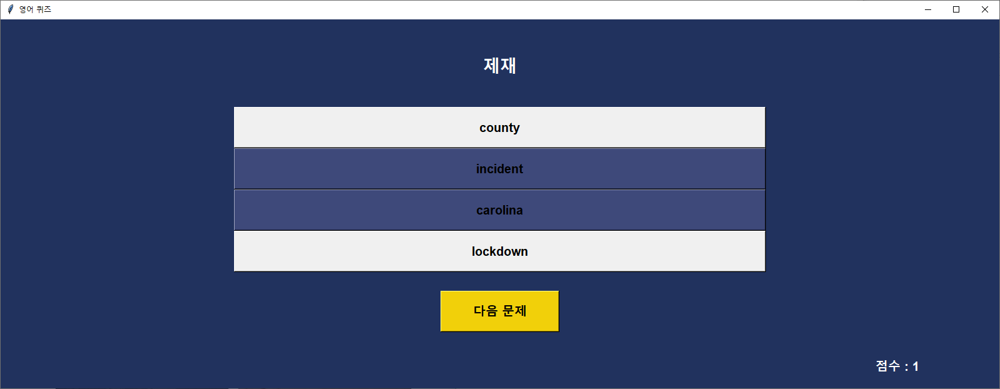
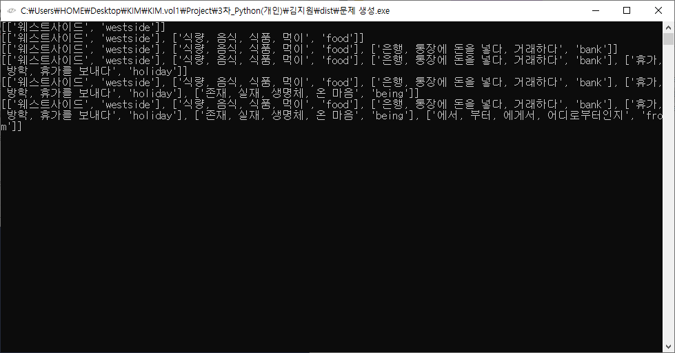

# 🐍 웹 크롤링을 이용한 영어단어 퀴즈
> **BeautifulSoup를 활용한 해외 뉴스 크롤링 및 네이버 사전 연동 영단어 퀴즈**
> 프로젝트 기간: 2023.08.30 ~ 2023.09.01 (개인 프로젝트)

## 📄 프로젝트 요약
- 해외 뉴스 사이트 기사 크롤링
- 네이버 사전 크롤링
- 뉴스 기사 단어와 네이버 사전 뜻 매칭 후 CSV 파일 생성
- CSV 파일을 사용한 영어 단어 퀴즈

---

## 🛠️ 사용 기술 및 라이브러리
- Python
- Requests (네이버 사전 데이터)
- BeautifulSoup (뉴스 크롤링)

---

## 🖼️ 실행 화면 (토글 클릭)

📸 프로그램 프리뷰 (클릭)

---

## 💡 깨달은 점
- **BeautifulSoup**를 이용해 해외 뉴스 사이트 기사 크롤링 가능
- 네이버사전의 단어 내용은 HTML상에 정보가 없고 서버에서 데이터를 불러오는 형식 → BeautifulSoup로 불가능. **get방식** 후 json.loads로 크롤링 가능
- **Python TK** 사용 경험
- **CSV** 파일 생성 후 데이터 사용 경험
